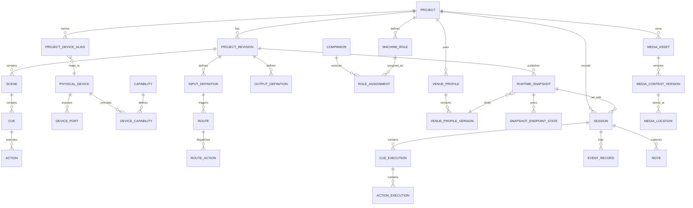

# StageCore Data Model — v0.1

**Document Type:** Data Model Specification  
**Status:** Initial Engineering Model  
**Based on:** StageCore Master Plan v0.2 + Addendum 001 + System Architecture v0.1  
**Purpose:** تثبيت الكيانات الأساسية، ملكية البيانات، العلاقات، والإصدارات قبل اختيار Database أوORM نهائي.

> هذه الوثيقة تصف **Logical Data Model**، وليست SQL schema نهائية.

## 1. Modeling Principles

1. **Hub Authority** — الـHub هو Source of Truth للـProject، Published Runtime، Cue State، Vault Metadata وSessions.
2. **Stable IDs** — كل كيان رئيسي يمتلك ID ثابتًا لا يعتمد على الاسم أوIP أوfilename. نوع الـID النهائي (UUID/ULID/غيره) قرار تقني لاحق.
3. **Physical ≠ Logical** — الجهاز الفيزيائي منفصل عن اسمه ودوره داخل Project.
4. **Draft ≠ Published Runtime** — التعديلات لا تؤثر في العرض حتى يتم Validate + Publish إلى Runtime Snapshot.
5. **Versioned Definitions** — Project Revision وVenue Profile Version وRuntime Snapshot تحفظ ما استُخدم فعليًا.
6. **Append-Oriented History** — Events،Cue Executions،Rehearsal/Show records لا تُعاد كتابتها بصمت.
7. **Content Identity** — Media identity تعتمد checksum/content identity، وليس filename فقط.
8. **Local Copies Are Caches** — Companion/Node يحتفظان بنسخ تشغيل محدودة، لكنهما لا يصبحان مصدر الحقيقة.
9. **Safety Classification Is Data** — Actions/Outputs الحرجة تحمل تصنيفًا وسياسة تنفيذ واضحة.
10. **No Technology Lock-In** — لا تفترض هذه الوثيقة PostgreSQL/SQLite أوأي ORM بعينه.

## 2. Entity Map

### 2.1 Core Project Model

| Entity | Purpose | MVP |
|---|---|---|
| `Project` | الهوية الدائمة للعرض | Yes |
| `ProjectRevision` | نسخة قابلة للتحرير/التتبع من منطق العرض | Yes |
| `Act` | تقسيم درامي اختياري | Later/MVP-light |
| `Scene` | تقسيم المشاهد | Yes |
| `Cue` | وحدة منطق العرض | Yes |
| `Action` | أمر واحد داخل Cue | Yes |
| `Note` | ملاحظة مرتبطة بالسياق التشغيلي | Yes |

### 2.2 Devices & Abstraction

| Entity | Purpose | MVP |
|---|---|---|
| `PhysicalDevice` | جهاز حقيقي مسجل في StageCore | Yes |
| `DevicePort` | منفذ فعلي أوendpoint داخل جهاز | Yes-light |
| `Capability` | قدرة عامة مثل `osc.send`, `relay.set`, `projector.power` | Yes |
| `DeviceCapability` | ربط جهاز بقدرة وإعداداتها | Yes |
| `ProjectDeviceAlias` | الاسم/الدور المنطقي للجهاز أوالمنفذ داخل Project | Yes |
| `Node` | StageCore Node ميداني | Model now / Hardware later |
| `Companion` | Mac/PC Companion موثوق | Yes |
| `MachineRole` | دور منطقي مثل VIDEO-MAIN | Yes |
| `RoleAssignment` | ربط Machine Role بجهاز Companion فعلي | Yes |

### 2.3 Routing & Runtime

| Entity | Purpose | MVP |
|---|---|---|
| `InputDefinition` | مصدر حدث منطقي | Yes |
| `OutputDefinition` | هدف تنفيذ منطقي | Yes |
| `Route` | Input → Conditions/Transform → Actions | Yes |
| `RouteAction` | Action ضمن Route | Yes |
| `RuntimeSnapshot` | نسخة تشغيل Immutable منشورة | Yes |
| `SnapshotEndpointState` | حالة Sync لكل Companion/Node/Client | Yes-light |

### 2.4 Venue & Lighting

| Entity | Purpose | MVP |
|---|---|---|
| `VenueProfile` | هوية المسرح/المكان | Model now |
| `VenueProfileVersion` | Mapping فعلي محفوظ للمكان | Model now |
| `VenueMapping` | Logical Output → Physical Target | Post-MVP |
| `LightingLogicalOutput` | اسم منطقي مثل Front Wash | Model now |
| `LightingScale` | Venue/group/fixture scaling & limits | Post-MVP |

### 2.5 Rehearsal, Show & Memory

| Entity | Purpose | MVP |
|---|---|---|
| `Session` | أصل مشترك لبروفة أوعرض | Yes |
| `CueExecution` | سجل تنفيذ Cue واحد | Yes |
| `ActionExecution` | نتيجة Action فعلية | Yes |
| `EventRecord` | سجل الأحداث التشغيلية | Yes |
| `TransitionRecord` | الانتقال الفعلي والتوقيت | Post-MVP |
| `PerformanceRecording` | تسجيل فيديو/صور للعرض | Model now / Post-MVP UI |

### 2.6 Media, Vault & Plugins

| Entity | Purpose | MVP |
|---|---|---|
| `MediaAsset` | الأصل المنطقي المستخدم بالمشروع | Yes-light |
| `MediaContentVersion` | نسخة محتوى محددة بالchecksum | Yes-light |
| `MediaLocation` | مكان وجود نسخة من المحتوى | Yes-light |
| `PluginDefinition` | Plugin مثبت/معروف | Yes |
| `PluginRequirement` | ما يحتاجه Project/Runtime من Plugins | Yes |
| `BackupRecord` | حالة نسخة احتياطية موثقة | Post-MVP |
| `ArchiveRecord` | حالة Project Archive | Post-MVP |

## 3. High-Level Relationship Diagram

## 4. Project & Revision Model

### `Project`

يمثل العرض كهوية طويلة الأمد.

Minimum fields:

- `project_id`
- `name`
- `description`
- `lifecycle_state`: `ACTIVE | FINAL | ARCHIVED`
- `created_at`
- `updated_at`
- `current_revision_id`
- `default_venue_profile_id` nullable

### `ProjectRevision`

يمثل نسخة منطق العرض القابلة للتتبع.

- `revision_id`
- `project_id`
- `revision_number` أوlabel
- `status`: `DRAFT | VALIDATED | SUPERSEDED`
- `parent_revision_id` nullable
- `created_at`
- `created_by`
- `change_note`

**Invariant:** Runtime Snapshot لا يُبنى من Project mutable مباشرة؛ يُبنى من Revision معروفة.

## 5. Cue Model

### `Scene`

- `scene_id`
- `revision_id`
- `act_id` nullable
- `name`
- `order_index`

### `Cue`

- `cue_id`
- `revision_id`
- `scene_id` nullable
- `number` / `display_label`
- `name`
- `order_index`
- `cue_type`
- `criticality`: `NORMAL | CRITICAL | SAFETY_CRITICAL`
- `enabled`
- `execution_policy`
- `notes_summary` nullable

### `Action`

- `action_id`
- `cue_id`
- `order_index`
- `execution_mode`: `SEQUENTIAL | PARALLEL | PARALLEL_BARRIER`
- `target_ref` — logical target/capability reference
- `capability_key`
- `parameters`
- `timeout_policy`
- `error_policy`
- `priority_class`: `P0 | P1 | P2 | P3`
- `enabled`

**Rule:** Action يفضل أن يستهدف Capability + Logical Alias/Machine Role، لاIP/DMX channel خام عندما توجد طبقة تجريد مناسبة.

## 6. Device & Capability Model

### `PhysicalDevice`

- `device_id`
- `device_type`
- `manufacturer` nullable
- `model` nullable
- `serial_number` nullable
- `mac_address` nullable
- `network_identity` nullable
- `connection_type`
- `firmware_version` nullable
- `trust_state`
- `health_state`

### `DevicePort`

- `port_id`
- `device_id`
- `port_type`
- `port_index`
- `direction`: `INPUT | OUTPUT | BIDIRECTIONAL`
- `metadata`

### `Capability`

Capability keys تكون stable/versioned، مثل:

- `osc.send`
- `midi.send`
- `http.request`
- `relay.set`
- `sensor.read`
- `projector.power`
- `projector.input_select`
- `printer.print_text`

Fields:

- `capability_id`
- `key`
- `schema_version`
- `input_schema`
- `output_schema`
- `criticality_max`

### `ProjectDeviceAlias`

- `alias_id`
- `project_id`
- `logical_name`
- `device_id`
- `port_id` nullable
- `logical_type`
- `group_name` nullable
- `project_config`

مثال: `StageNode-02 / Input 1` يصبح داخل مشروع **العميان**: `Door Sensor`.

## 7. Companion & Machine Role Model

### `Companion`

- `companion_id`
- `device_identity_id`
- `display_name`
- `os_type`
- `agent_version`
- `trust_state`
- `last_seen_at`
- `health_state`
- `machine_capabilities`

### `MachineRole`

- `machine_role_id`
- `project_id`
- `name` — مثل `VIDEO-MAIN`
- `requirements`
- `role_configuration`
- `required_media_set`

### `RoleAssignment`

- `assignment_id`
- `machine_role_id`
- `companion_id`
- `status`: `ASSIGNED | READY | DEGRADED | RELEASED`
- `assigned_at`
- `released_at` nullable
- `runtime_snapshot_id` nullable

**Default invariant:** Machine Role التشغيلية الواحدة لها Active Assignment واحدة ما لم يعتمد Failover model لاحقًا.

## 8. Routing Model

### `InputDefinition`

- `input_id`
- `revision_id`
- `name`
- `source_ref`
- `event_type`
- `value_schema`
- `enabled`

### `OutputDefinition`

- `output_id`
- `revision_id`
- `name`
- `target_ref`
- `capability_key`
- `value_schema`
- `criticality`

### `Route`

- `route_id`
- `revision_id`
- `name`
- `input_id`
- `condition_definition` nullable
- `transform_definition` nullable
- `delay_ms` nullable
- `debounce_ms` nullable
- `priority_class`
- `error_policy`
- `enabled`

### `RouteAction`

- `route_action_id`
- `route_id`
- `order_index`
- `output_id` nullable
- `cue_id` nullable
- `parameters`

**Invariant:** Route evaluation في SHOW يستخدم نسخة موجودة داخل Runtime Snapshot فقط.

## 9. Venue Profile Model

### `VenueProfile`

- `venue_profile_id`
- `project_id` nullable — يسمح مستقبلًا بمشاركة profile
- `name`
- `venue_name`
- `location_notes`

### `VenueProfileVersion`

- `venue_profile_version_id`
- `venue_profile_id`
- `version_number`
- `device_mappings`
- `projector_mappings`
- `network_mappings`
- `dmx_patch`
- `stage_node_assignments`
- `lighting_mapping`
- `scaling_limits`
- `created_at`

**Rule:** Cue values المنطقية تبقى ثابتة؛ Venue Profile يترجمها إلى الأجهزة الفعلية.

## 10. Runtime Snapshot Model

`RuntimeSnapshot` هو الحد الفاصل بين EDIT وSHOW.

Fields:

- `runtime_snapshot_id`
- `project_id`
- `revision_id`
- `venue_profile_version_id` nullable
- `snapshot_version`
- `created_at`
- `created_by`
- `content_hash` أوmanifest identity
- `cue_manifest`
- `route_manifest`
- `role_assignment_manifest`
- `device_mapping_manifest`
- `plugin_requirement_manifest`
- `media_manifest`
- `safety_manifest`
- `status`: `PUBLISHED | SUPERSEDED | REVOKED`

### `SnapshotEndpointState`

- `endpoint_state_id`
- `runtime_snapshot_id`
- `endpoint_type`: `COMPANION | NODE | CLIENT`
- `endpoint_id`
- `reported_snapshot_id`
- `sync_state`: `PENDING | SYNCED | MISMATCH | ERROR`
- `checked_at`

**Invariant:** Draft changes never mutate an existing Runtime Snapshot.

## 11. Session & Show Memory Model

### `Session`

واحد من:

- `REHEARSAL`
- `SHOW`
- `SIMULATION`

Fields:

- `session_id`
- `project_id`
- `runtime_snapshot_id`
- `venue_profile_version_id` nullable
- `session_type`
- `name`
- `started_at`
- `ended_at` nullable
- `operator_ids`
- `status`

### `CueExecution`

- `cue_execution_id`
- `session_id`
- `cue_id`
- `correlation_id`
- `trigger_source`
- `expected_at` nullable
- `started_at`
- `completed_at` nullable
- `result`
- `manual_override`

### `ActionExecution`

- `action_execution_id`
- `cue_execution_id`
- `action_id`
- `started_at`
- `completed_at` nullable
- `result`
- `latency_ms` nullable
- `response_summary`
- `error_code` nullable

### `EventRecord`

- `event_id`
- `session_id` nullable
- `event_type`
- `occurred_at`
- `observed_at`
- `source_ref`
- `correlation_id` nullable
- `causation_id` nullable
- `priority`
- `runtime_snapshot_id` nullable
- `payload`

## 12. Notes Model

`Note` يدعم Digital Prompt Book.

- `note_id`
- `project_id`
- `revision_id` nullable
- `session_id` nullable
- `note_type`: `OPERATOR | DIRECTOR | ACTOR_LINE | ACTOR_MOVEMENT | LIGHTING | VIDEO | AUDIO | SAFETY | STAGE_MANAGEMENT`
- `text`
- `status`: `KEEP_IN_SHOW | REHEARSAL_ONLY | RESOLVED`
- `cue_id` nullable
- `next_cue_id` nullable
- `scene_id` nullable
- `actor_ref` nullable
- `time_offset_ms` nullable
- `created_at`
- `created_by`

## 13. Media & Vault Model

### `MediaAsset`

هوية منطقية داخل المشروع.

- `media_asset_id`
- `project_id`
- `logical_name`
- `media_type`
- `storage_policy`: `REFERENCE_ONLY | MANAGED | ARCHIVE_REQUIRED`
- `current_content_version_id` nullable

### `MediaContentVersion`

- `content_version_id`
- `media_asset_id`
- `content_identity`
- `checksum_algorithm`
- `checksum`
- `size_bytes`
- `format_metadata`
- `created_at`

### `MediaLocation`

- `media_location_id`
- `content_version_id`
- `location_type`: `HUB | COMPANION_CACHE | NAS | EXTERNAL | CLOUD`
- `location_ref`
- `availability_state`
- `verified_at` nullable

**Invariant:** Same filename لا يعني same content، وsame content يمكن أن يوجد في عدة Locations.

## 14. Plugin Requirements

### `PluginDefinition`

- `plugin_id`
- `plugin_key`
- `installed_version`
- `trust_level`
- `capabilities_provided`
- `health_state`

### `PluginRequirement`

- `plugin_requirement_id`
- `revision_id`
- `plugin_key`
- `version_constraint`
- `required_capabilities`
- `required_for_show`

Runtime Snapshot يثبت requirement manifest حتى يستطيع Preflight كشف mismatch.

## 15. Data Ownership Rules

| Data | Authority | Cached/Observed By |
|---|---|---|
| Project / Revision | Hub | Clients |
| Published Runtime Snapshot | Hub | Companion / Node / Client |
| Cue State | Hub Core | Clients / Companion observed cache |
| Machine Configuration | Companion | Hub metadata only |
| Node Safe-State / Hardware Config | Node ضمن policy | Hub registry |
| Project Alias / Logical Mapping | Hub | endpoints via snapshot |
| Media Master Metadata | Hub Vault | Companions/NAS caches |
| Rehearsal/Show History | Hub | reports/backups |

لا نستخدم `last-write-wins` للأوامر التشغيلية أوauthority conflicts.

## 16. Required Invariants

1. كل `Session` تشغيلية ترتبط بـ`RuntimeSnapshot` محددة.
2. كل `CueExecution` يشير إلى Cue الموجودة في Snapshot المستخدمة.
3. لا يتم تعديل Runtime Snapshot منشورة in-place.
4. `ProjectDeviceAlias` لا يصبح هوية الجهاز الفيزيائي.
5. Role Assignment لا يغير Cue definitions.
6. Media cache mismatch يمنع `READY` إذا كانت المادة Required.
7. Reconnect لا يعيد آخر Action تلقائيًا.
8. Event history لا يستخدم وحده لإعادة تنفيذ Actions حرجة.
9. ARCHIVED Project Revision لا تعدل مباشرة؛ ينشأ Revival/Revision جديد.
10. Safety-Critical mapping لا تتجاوز Hardware safety layer بسبب قيمة في Database فقط.

## 17. MVP Persistence Boundary

أول تنفيذ فعلي يحتاج على الأقل:

- Project / ProjectRevision
- Scene / Cue / Action
- PhysicalDevice / Capability / ProjectDeviceAlias
- MachineRole / Companion / RoleAssignment
- InputDefinition / OutputDefinition / Route / RouteAction
- RuntimeSnapshot / SnapshotEndpointState مبسط
- Session / CueExecution / ActionExecution / EventRecord
- Note
- PluginDefinition / PluginRequirement
- MediaAsset metadata مبسط

يمكن تأجيل الجداول التفصيلية لـVenue Mapping،Lighting Scaling،Archive،Backup،Performance Recording وHardware Nodes حتى تثبت الحلقة الأساسية.

## 18. Example End-to-End Data Flow

مشروع **العميان**:

1. `Project` = العميان.
2. `ProjectRevision` = Dress Rehearsal v4.
3. `MachineRole` = VIDEO-MAIN.
4. `PhysicalDevice` = MacBook جديد.
5. `RoleAssignment` يربط MacBook بـVIDEO-MAIN.
6. `Cue 24` يحتوي `Action` يستهدف VIDEO-MAIN capability `osc.send`.
7. `Publish` ينشئ `RuntimeSnapshot v17`.
8. Companion يعلن `SnapshotEndpointState = SYNCED`.
9. أثناء Rehearsal ينشأ `Session`.
10. GO ينشئ `CueExecution` ثم `ActionExecution`.
11. النتائج والأخطاء تحفظ كـ`EventRecord`.
12. ملاحظة "انتظر جملة الممثل" تحفظ `Note` مرتبطة بالـNext Cue.

## 19. Open Questions for v0.2

لا تُحسم هنا:

- UUID vs ULID أوغيره للـIDs.
- Database engine ونمط embedded vs client/server.
- JSON/document fields مقابل normalized tables لكل parameters/configuration.
- Event retention وpartitioning strategy.
- Event Store كامل أمappend-oriented audit tables فقط.
- Project/Venue sharing ownership model.
- Active-active Machine Role failover model.
- Exact media checksum algorithm والlarge-file strategy.
- Soft-delete/retention rules لكل entity.
- User/Role/Permission schema التفصيلية.

## 20. Next Documents

بعد اعتماد Data Model v0.1، الترتيب المقترح:

1. **StageCore Event & Command Contracts v0.1**
2. **StageCore MVP Product Specification v0.1**
3. **Technology Selection / Decision Spikes**
4. **StageCore Plugin Contract v0.1**
5. **StageCore Companion Specification v0.1**

---

**Data Model v0.1 principle:**

> Project intent يبقى منطقيًا وقابلاً للنقل؛ Runtime Snapshot يثبت ما سيعمل؛ Session يسجل ما حدث فعليًا.
